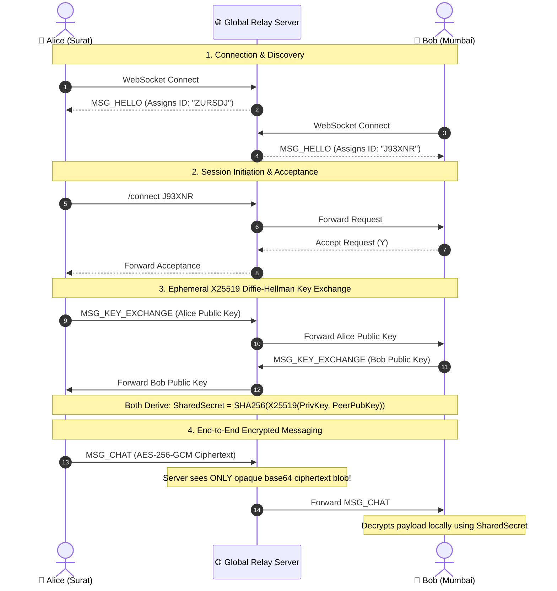

<div align="center">

# 🔒 TermChat

### Zero-Knowledge, End-to-End Encrypted Terminal 1-on-1 Chat

[](https://go.dev)
[](https://github.com/viveksec/termchat)
[](pkg/crypto/crypto.go)
[](LICENSE)
[](cmd/server/main_test.go)

<p align="center">
  <b>Chat securely with anyone in Surat, Mumbai, New York, or Tokyo — straight from your terminal.</b><br>
  <i>No accounts · No phone numbers · No data collection · Zero-Knowledge Relay</i>
</p>

```
  ████████╗███████╗██████╗ ███╗   ███╗ ██████╗██╗  ██╗ █████╗ ████████╗
  ╚══██╔══╝██╔════╝██╔══██╗████╗ ████║██╔════╝██║  ██║██╔══██╗╚══██╔══╝
     ██║   █████╗  ██████╔╝██╔████╔██║██║     ███████║███████║   ██║   
     ██║   ██╔══╝  ██╔══██╗██║╚██╔╝██║██║     ██╔══██║██╔══██║   ██║   
     ██║   ███████╗██║  ██║██║ ╚═╝ ██║╚██████╗██║  ██║██║  ██║   ██║   
     ╚═╝   ╚══════╝╚═╝  ╚═╝╚═╝     ╚═╝ ╚═════╝╚═╝  ╚═╝╚═╝  ╚═╝   ╚═╝  
```

---

### ⚡ Run Anywhere in 1 Command (Zero Setup)

```bash
go run github.com/viveksec/termchat/cmd/client@latest
```

</div>

---

## ✨ Features at a Glance

<table>
  <tr>
    <td width="50%">
      <h3>🔒 Zero-Knowledge Architecture</h3>
      The central relay server routes raw JSON packets using anonymous 6-character short IDs. It never possesses private keys, shared secrets, or unencrypted message payloads.
    </td>
    <td width="50%">
      <h3>🔑 Perfect Forward Secrecy</h3>
      Every chat session negotiates an ephemeral <b>X25519 Curve25519</b> Diffie-Hellman key pair. Even if past keys were compromised, prior session plaintexts remain mathematically unrecoverable.
    </td>
  </tr>
  <tr>
    <td width="50%">
      <h3>🛡️ AES-256-GCM Encryption</h3>
      All message payloads are authenticated and encrypted locally using 256-bit symmetric keys derived via SHA-256 KDF with fresh 96-bit random nonces.
    </td>
    <td width="50%">
      <h3>🌐 Multi-Node Global Fallback</h3>
      Connects out-of-the-box across cities (Surat ↔ Mumbai ↔ Worldwide) with automated multi-node failover cluster support.
    </td>
  </tr>
</table>

---

## 📐 Architecture & Key Exchange Flow



---

## 🚀 Quick Start Guide

### Option 1: Instant One-Liner (No cloning required)

```bash
go run github.com/viveksec/termchat/cmd/client@latest
```

### Option 2: Clone & Build

```bash
# Clone the repository
git clone https://github.com/viveksec/termchat.git
cd termchat

# Build release binaries
go build -o bin/relay-server ./cmd/server
go build -o bin/termchat     ./cmd/client

# Launch local relay server (optional)
./bin/relay-server -addr :8080

# Launch client
./bin/termchat
```

---

## ⌨️ Command & Keybinding Reference

### Slash Commands

| Command | Argument | Description |
|:---|:---|:---|
| `/connect` | `<USER_ID>` | Initiate a 1-on-1 encrypted session with a peer by short ID |
| `/disconnect` | — | Leave current chat session and securely erase session key |
| `/clear` | — | Clear current chat history viewport |
| `/whoami` | — | Display your assigned 6-character short ID |
| `/help` | — | Toggle interactive full-screen help modal |

### Keyboard Shortcuts

| Shortcut | Context | Action |
|:---|:---|:---|
| `Enter` | Message Input | Send message / execute command / confirm modal |
| `Y` / `N` | Incoming Request Modal | Accept (`Y`) or Decline (`N`) incoming request |
| `F1` / `Esc` | Global | Toggle Help overlay / dismiss modal |
| `Ctrl+D` | Active Chat | End current encrypted session |
| `Ctrl+C` | Global | Clean exit & restore terminal state |
| `PgUp` / `PgDn` | Chat Viewport | Scroll chat history up or down |

---

## 🔒 Security & Threat Model

| Threat Scenario | Risk Level | TermChat Protection |
|:---|:---:|:---|
| **Eavesdropping Relay** | 🔴 High | All messages encrypted with AES-256-GCM before leaving client |
| **Active Relay MITM** | 🟠 Medium | Ephemeral DH exchange — relay cannot derive symmetric key without private keys |
| **Packet Tampering** | 🔴 High | GCM 128-bit authentication tag verification rejects altered payloads |
| **Replay Attack** | 🟡 Low | Fresh random 96-bit nonces per packet + UTC timestamp validation |
| **Subgroup Attacks** | 🟠 Medium | RFC 7748 Curve25519 scalar clamping + zero-point verification |

---

## 🧪 Testing & Verification

```bash
# Run unit & integration test suite across all packages
go test -v ./...

# Run live trace demonstration
go run ./cmd/demo/main.go
```

---

## 📄 License

Distributed under the [MIT License](LICENSE).
