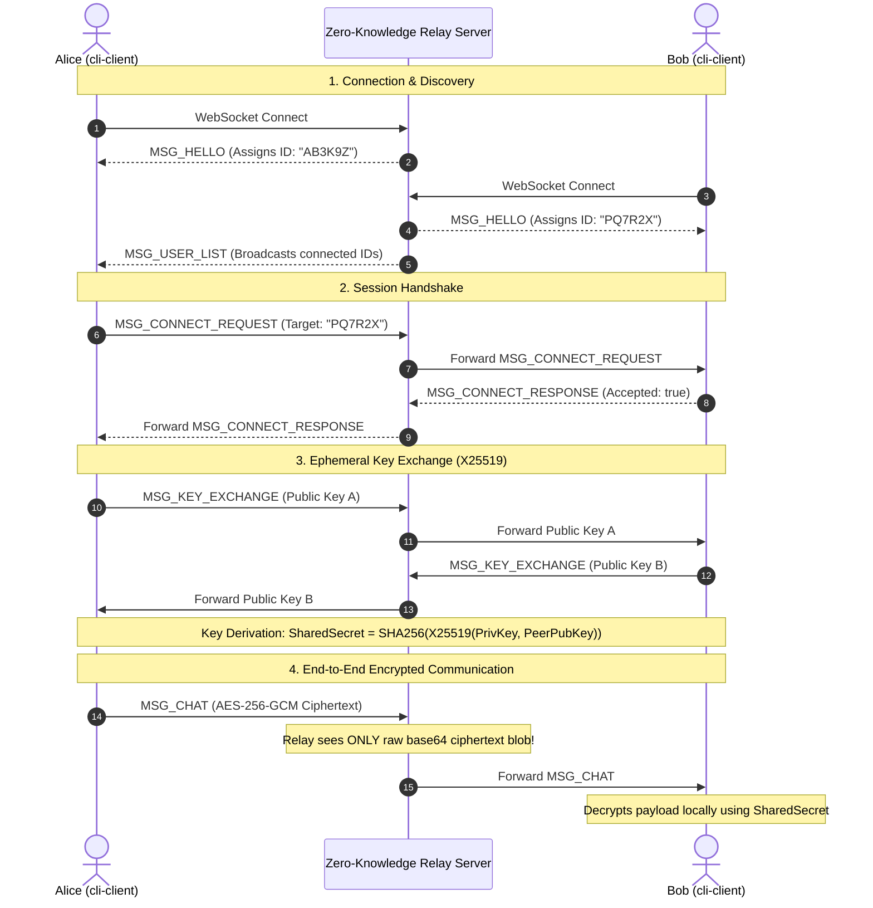

<div align="center">

# 🔒 TermChat

### Production-Ready End-to-End Encrypted Terminal Chat in Go

[](https://go.dev)
[](pkg/crypto/crypto.go)
[](LICENSE)
[](cmd/server/main.go)
[](cmd/server/main_test.go)

<p align="center">
  <b>Ephemeral Key Exchange · Perfect Forward Secrecy · Bubbletea TUI · Auto-Reconnect</b>
</p>

```
  ████████╗███████╗██████╗ ███╗   ███╗ ██████╗██╗  ██╗ █████╗ ████████╗
  ╚══██╔══╝██╔════╝██╔══██╗████╗ ████║██╔════╝██║  ██║██╔══██╗╚══██╔══╝
     ██║   █████╗  ██████╔╝██╔████╔██║██║     ███████║███████║   ██║   
     ██║   ██╔══╝  ██╔══██╗██║╚██╔╝██║██║     ██╔══██║██╔══██║   ██║   
     ██║   ███████╗██║  ██║██║ ╚═╝ ██║╚██████╗██║  ██║██║  ██║   ██║   
     ╚═╝   ╚══════╝╚═╝  ╚═╝╚═╝     ╚═╝ ╚═════╝╚═╝  ╚═╝╚═╝  ╚═╝   ╚═╝  
```

</div>

---

## ⚡ Highlights

- **🔒 Zero-Knowledge Relay**: Server routes raw JSON envelopes by 6-character short IDs. It never possesses private keys, shared secrets, or plaintext payload data.
- **🔑 X25519 Key Exchange**: Ephemeral Curve25519 Diffie-Hellman handshake negotiated per 1-on-1 session guarantees **Perfect Forward Secrecy (PFS)**.
- **🛡️ AES-256-GCM Encryption**: All chat payloads are authenticated and encrypted locally using 256-bit symmetric keys with fresh 96-bit random nonces.
- **✨ Split-Panel TUI**: Modern split terminal interface powered by [`bubbletea`](https://github.com/charmbracelet/bubbletea), [`bubbles`](https://github.com/charmbracelet/bubbles), and [`lipgloss`](https://github.com/charmbracelet/lipgloss).
- **🔄 Resilient Networking**: Automatic reconnection with exponential backoff, ping/pong heartbeats, and graceful terminal state restoration on `Ctrl+C`.

---

## 📐 Architecture & Cryptographic Flow



---

## 🚀 Quick Start

### 1. Installation

```bash
# Clone the repository
git clone https://github.com/viveksec/termchat.git
cd termchat

# Build release binaries
go build -o bin/relay-server ./cmd/server
go build -o bin/termchat     ./cmd/client
```

### 2. Launch Local Server

```bash
./bin/relay-server -addr :8080
```

### 3. Launch Two Client Terminals

In separate terminal windows:

```bash
# Window 1 (Alice)
./bin/termchat -server ws://localhost:8080/ws

# Window 2 (Bob)
./bin/termchat -server ws://localhost:8080/ws
```

1. Note Bob's 6-character short ID in the status bar (e.g. `PQ7R2X`).
2. In Alice's window, run: `/connect PQ7R2X`.
3. In Bob's window, press `Y` + `Enter` to accept.
4. X25519 key exchange completes automatically — start chatting securely!

---

## ⌨️ Command & Keybinding Reference

### Slash Commands

| Command | Argument | Description |
|:---|:---|:---|
| `/connect` | `<USER_ID>` | Send a session request to a target client by short ID |
| `/disconnect` | — | End the active 1-on-1 encrypted session |
| `/clear` | — | Clear local chat history viewport |
| `/whoami` | — | Display your assigned 6-character short ID |
| `/help` | — | Open interactive full-screen help modal |

### Keyboard Shortcuts

| Shortcut | Context | Action |
|:---|:---|:---|
| `Enter` | Input | Send message / execute command / accept dialog |
| `Y` / `N` | Incoming Request | Accept (`Y`) or Decline (`N`) incoming request |
| `F1` / `Esc` | Global | Toggle Help overlay / dismiss modal |
| `Ctrl+D` | Active Chat | Leave current encrypted chat session |
| `Ctrl+C` | Global | Clean shutdown & terminal state restore |
| `PgUp` / `PgDn` | Chat Viewport | Scroll chat history up or down |

---

## 🔒 Security Threat Matrix

| Threat Model | Attack Vector | TermChat Defense Mechanism |
|:---|:---|:---|
| **Eavesdropping Relay** | Server inspects WebSocket traffic | Payload is AES-256-GCM encrypted; relay never holds keys |
| **Session Compromise** | Long-term key theft | Ephemeral X25519 keypair per client launch (**PFS**) |
| **Message Tampering** | Bit-flipping / payload alteration | GCM 128-bit authentication tag verification |
| **Replay Attack** | Re-sending captured packets | Fresh 96-bit random nonces per message + UTC timestamps |
| **Small-Subgroup Attack** | Low-order Curve25519 points | RFC 7748 scalar clamping + zero-point detection |

---

## 🌐 Cloud Deployment Options

### Fly.io (Recommended)

Create `fly.toml`:
```toml
app = "termchat-relay"
primary_region = "ord"

[build]
  [build.args]
    GO_BUILD_TARGET = "./cmd/server"

[[services]]
  protocol = "tcp"
  internal_port = 8080
  [[services.ports]]
    port = 443
    handlers = ["tls", "http"]
```

Deploy with 1 command:
```bash
fly deploy
```
Clients connect to: `wss://termchat-relay.fly.dev/ws`

---

## 🛠️ Project Structure

```
termchat/
├── cmd/
│   ├── client/
│   │   ├── main.go          # Client bootstrapper & WebSocket event loop
│   │   └── ui.go            # Bubbletea TUI model, views & keybinds
│   ├── demo/
│   │   └── main.go          # Live end-to-end trace & demonstration script
│   └── server/
│       ├── main.go          # Zero-knowledge relay server
│       └── main_test.go     # Relay integration test suite
├── pkg/
│   ├── crypto/
│   │   ├── crypto.go        # X25519 DH, SHA-256 KDF & AES-256-GCM
│   │   └── crypto_test.go   # Crypto unit test suite
│   └── protocol/
│       ├── protocol.go      # Protocol envelope & JSON payload structs
│       └── protocol_test.go # Protocol unit test suite
├── go.mod
├── go.sum
└── README.md
```

---

## 🧪 Running Tests

```bash
# Run unit & integration tests across all packages
go test -v ./...

# Run live trace demonstration
go run ./cmd/demo/main.go
```

---

## 📄 License

This project is licensed under the [MIT License](LICENSE).
